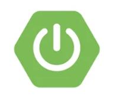
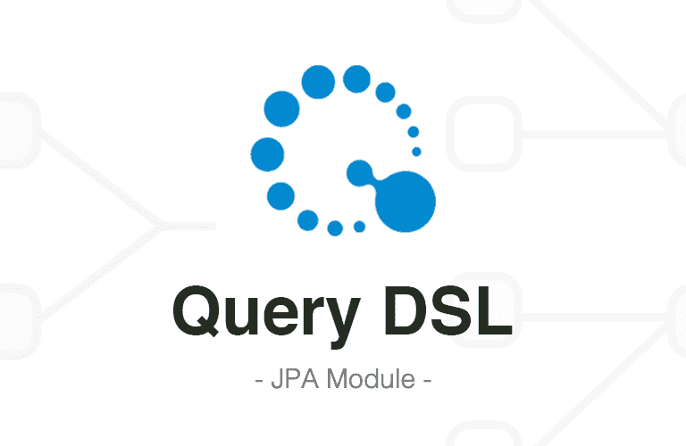

# SHOP PROJECT

_by 0808wonje_

---

# 기술 스택

## _FrameWork_

 

### &nbsp;&nbsp;&nbsp; Spring Boot &nbsp;&nbsp;&nbsp;&nbsp; Spring Data JPA &nbsp; Spring Web MVC 

## _TemplateEngine_
 

### &nbsp;&nbsp;&nbsp;&nbsp; Thymeleaf

## _RDBMS_

 

### &nbsp;&nbsp;&nbsp;&nbsp;&nbsp;&nbsp;&nbsp; MySQL &nbsp;&nbsp;&nbsp;&nbsp;&nbsp;&nbsp;&nbsp;&nbsp;&nbsp;&nbsp;&nbsp;&nbsp;&nbsp;&nbsp; H2 Database &nbsp;&nbsp;&nbsp;&nbsp;&nbsp;&nbsp;&nbsp;&nbsp; Querydsl 

## _Etc_

 

### &nbsp;&nbsp;&nbsp;&nbsp;&nbsp; Bootstrap &nbsp;&nbsp;&nbsp;&nbsp;&nbsp;&nbsp;&nbsp;&nbsp; Lombok

---

