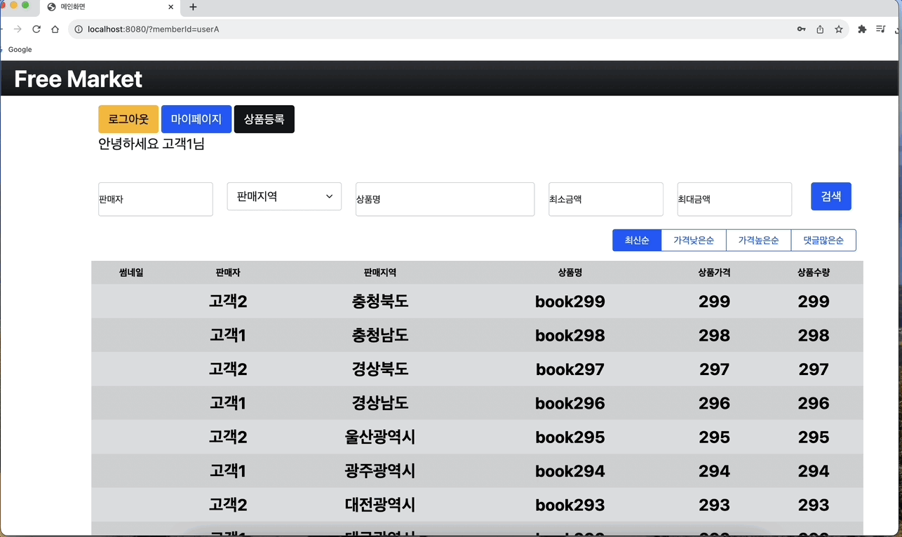
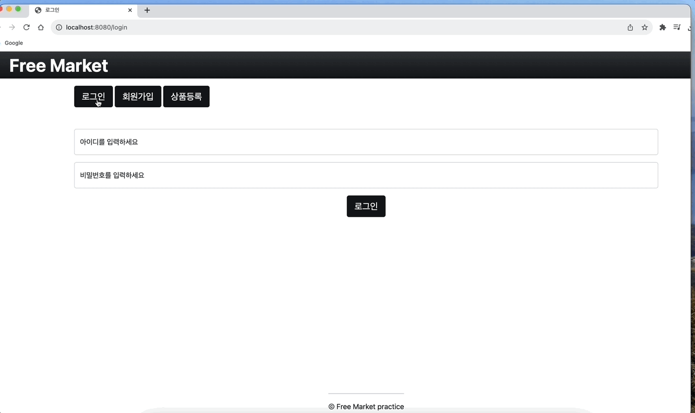
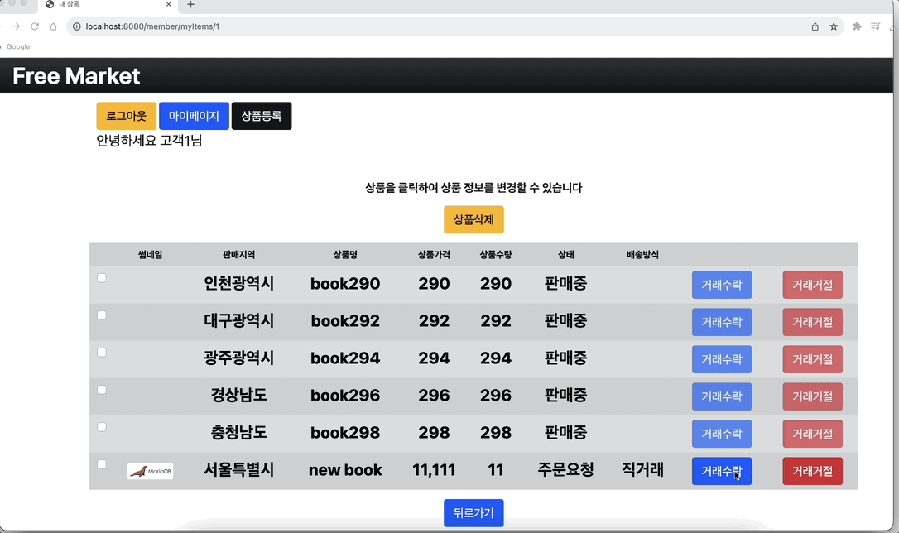
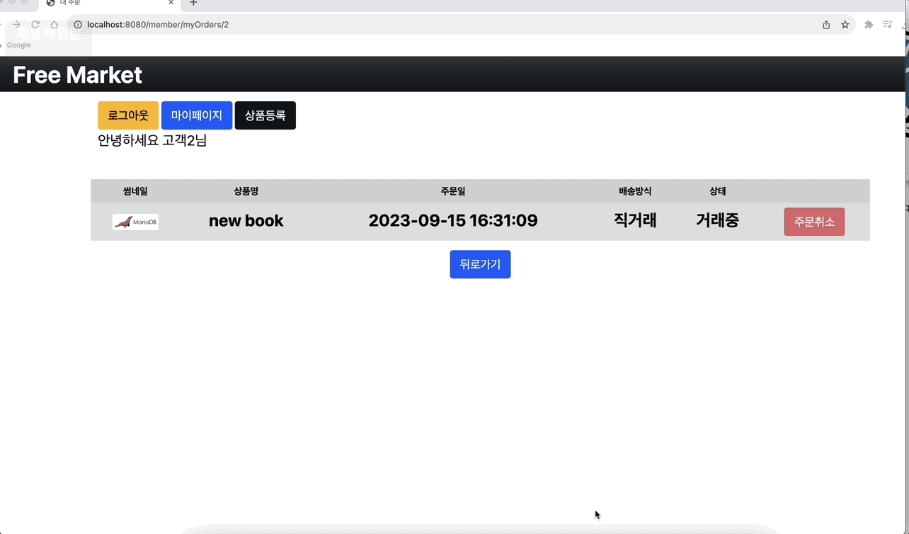
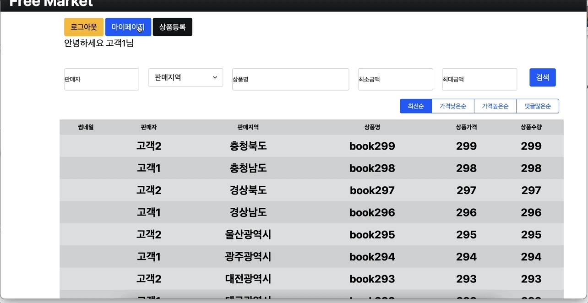

# SHOP PROJECT
>It's **Free Market Platform** which clients can trade anything they have. 
> 
>_by 0808wonje_

---

# 기술 스택
## _FrameWork_
&nbsp;
&nbsp;
 

### &nbsp;&nbsp;&nbsp; Spring Boot &nbsp;&nbsp;&nbsp;&nbsp; Spring Data JPA &nbsp; Spring Web MVC 

## _TemplateEngine_
 

### &nbsp;&nbsp;&nbsp;&nbsp; Thymeleaf

## _RDBMS_
&nbsp;
 

### &nbsp;&nbsp;&nbsp;&nbsp;&nbsp;&nbsp;&nbsp; MySQL &nbsp;&nbsp;&nbsp;&nbsp;&nbsp;&nbsp;&nbsp;&nbsp;&nbsp;&nbsp;&nbsp;&nbsp;&nbsp;&nbsp; H2 Database

## _Etc_
&nbsp;
&nbsp;
&nbsp;
&nbsp;
 

### &nbsp;&nbsp;&nbsp;&nbsp;&nbsp;&nbsp; Querydsl &nbsp;&nbsp;&nbsp;&nbsp;&nbsp;&nbsp;&nbsp;&nbsp;&nbsp;&nbsp;&nbsp;&nbsp;&nbsp; Bootstrap &nbsp;&nbsp;&nbsp;&nbsp;&nbsp;&nbsp;&nbsp;&nbsp;&nbsp;&nbsp;&nbsp;Lombok &nbsp;&nbsp;&nbsp;&nbsp;&nbsp;&nbsp;&nbsp;&nbsp;&nbsp;&nbsp;&nbsp;&nbsp;&nbsp;&nbsp;&nbsp;&nbsp;&nbsp;&nbsp;&nbsp;&nbsp; JUnit5 &nbsp;&nbsp;&nbsp;&nbsp;&nbsp;&nbsp;&nbsp;&nbsp;&nbsp;&nbsp;&nbsp;&nbsp;&nbsp;&nbsp;&nbsp;&nbsp;&nbsp;&nbsp; Docker

---

# Application Architecture
&nbsp;

# ERD
&nbsp;

# Core Business Logic Flow Chart
 
 
 

---

# WEB
## 검색 필터링
 

## 상품등록
 

## 주문요청
 

## 거래수락
&nbsp; 

## 거래완료
 